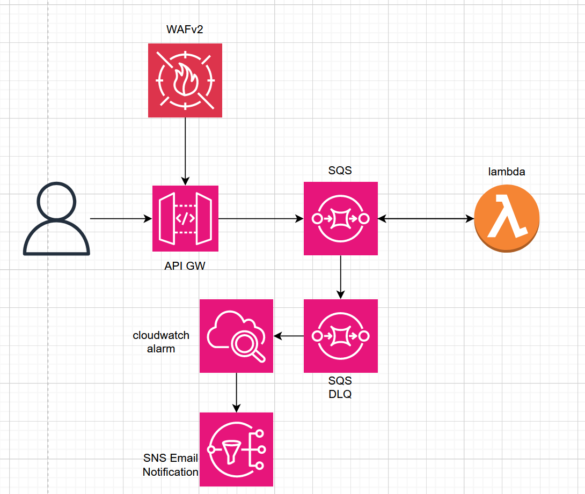

# AWS-Webhook-Template

### Preface

> I created this due to a need of a webhook that can processes large amounts of bursty POST request without overloading our database. To do so we are using amazons SQS Fifo queues. This ensures no message duplication and will let us process all the incoming request at a rate that we control and wont overwhelm any underlying systems. This also ensures all messages will be delivered with redrive policies and a dead-letter-queue for messages that cant be delivered no matter how many retries. This also adds a dead letter queue for messages or request that cant process after a few retries for inspection.

### Architecture Diagram

### Notes

- This uses FIFO queue to ensure no message duplication. If changed to standard, you will have to handle duplicate checking in code.
- Defaultly this delivers 1 message to 1 lambda execution, you can configure batching but need to handle it in the code as well.
- SQS triggers lambda, if the lambda function errors in any way or if the message is undeliverable to the lambda, it will be sent to the dead letter queue.
- The current throughput limit defaultly is ~300 messages per second. This can be increased by modifying the SQS to use high throughput mode but requires you to specify specific message groups based on properties in the data.
- You can optionally throttle the amount of concurrent lambdas processing the messages vai the lambdas trigger.

- Built in are the following rulesets for the WAF
- - AWSManagedRulesCommonRuleSet
- - AWSManagedRulesKnownBadInputsRuleSet
- - AWSManagedRulesAmazonIpReputationList
- - AWSManagedRulesAnonymousIpList

- If the lambda errors or its undeliverable, the SQS currently will retry sending the message to 2 times, you can change this in the template with the `maxReceiveCount` policy.
- You can change the email recieving alerts as well as the alert limits in the templates alarm section.
